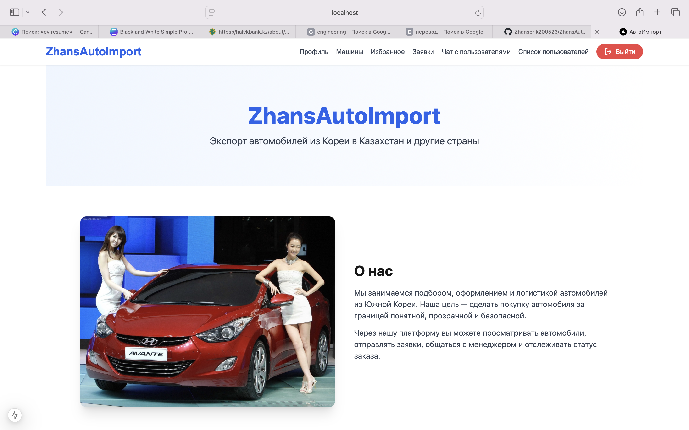

# 🚗 Car Import Platform (MERN Stack)

Веб-платформа для расчёта и оформления заявок на импорт автомобилей.  
Пользователи могут просматривать каталог машин, оформлять заявки и общаться с администратором через чат в реальном времени.

## ⚙️ Стек технологий
React, Node.js, Express, MongoDB, WebSocket, JWT, TailwindCSS, Axios, Docker

## 🚀 Запуск проекта
```bash
docker-compose up --build

## 📸 Скриншоты

### 🏠 Главная страница

